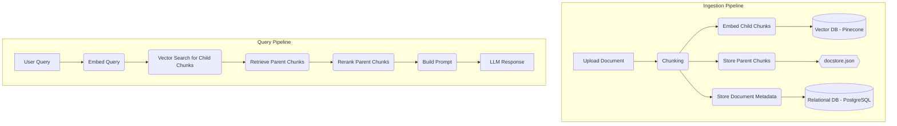

# Stroma-RAG: A Dual-Mode RAG Application

This project is a full-stack Retrieval-Augmented Generation (RAG) system built to provide contextual answers from PDF documents. It was developed to address the limitations of keyword-based search by implementing a multi-stage processing pipeline.

The application has a dual architecture:
1.  A **stateful service** with a persistent database for use with a pre-ingested, stable knowledge base.
2.  A **stateless webhook** that processes documents on-the-fly for single, isolated transactions.

## Key Features

* **Multi-Stage RAG Pipeline:** Implements a retrieve-rerank-generate sequence for processing queries.
* **Parent/Child Chunking:** Uses a chunking strategy where documents are split into large parent chunks for context and small child chunks for vector retrieval.
* **Semantic Splitting:** Parent chunks are created based on the document's logical structure (section headers) rather than a fixed character count.
* **Multi-API Integration:** Leverages several external APIs for its core functionality:
    * **Embeddings:** Jina AI
    * **Vector Search:** Pinecone
    * **Reranking:** Cohere
    * **Generation:** Google Gemini
* **FastAPI Backend:** Built with FastAPI, using Pydantic for data validation and Loguru for structured logging.
* **Triple Storage Backend:** The stateful service uses PostgreSQL for primary records, Pinecone for vectors, and a JSON file for the parent chunk document store.
* **Query Caching:** An in-memory cache is implemented to store results for recent, similar queries to improve response time.
* **Stateless Webhook:** A dedicated endpoint that can process a new document from a URL, using a temporary Pinecone index which is created and deleted for each request.

## Architecture & Data Flow

The system is composed of two distinct pipelines: an Ingestion Pipeline to process and store documents for the stateful service, and a Query Pipeline to answer user questions.

<details>
<summary>Click to view the Data Flow Diagram</summary>


</details>

## Tech Stack

* **Backend:** Python, FastAPI, Uvicorn
* **AI / LangChain:** LangChain, Jina API, Pinecone, Cohere API, Google Gemini API
* **Database:** PostgreSQL
* **Deployment:** Railway
* **Tooling:** Postman, Loguru, python-dotenv

## Project Structure

```
.
├── .env
├── .gitignore
├── Arogya Sanjeevani Policy - ... .pdf
├── docstore.json
├── hitl_feedback.csv
├── ingest.py
├── main.py
├── README.md
└── requirements.txt
```

## Local Setup and Installation

1.  **Clone the Repository:**
    ```bash
    git clone <your-repo-url>
    cd <repo-name>
    ```
2.  **Create and Activate a Virtual Environment:**
    ```bash
    python -m venv venv
    source venv/bin/activate  # On macOS/Linux
    .\venv\Scripts\activate  # On Windows
    ```
3.  **Install Dependencies:**
    ```bash
    pip install -r requirements.txt
    ```
4.  **Set Up Environment Variables:**
    Create a `.env` file in the root directory and populate it with your credentials. See `.env.example` for the required fields.
5.  **Run Ingestion (for Stateful Service):**
    To use the stateful endpoints, first populate the databases by running the ingestion script.
    ```bash
    python ingest.py
    ```
6.  **Run the FastAPI Server:**
    ```bash
    uvicorn main:app --reload
    ```
    The API will be available at `http://127.0.0.1:8000`.

## API Endpoints

| Method | Path                           | Description                                                                 |
| :----- | :----------------------------- | :-------------------------------------------------------------------------- |
| **POST** | `/api/v1/hackrx/run`           | **Stateless Webhook.** Processes a PDF from a URL and answers questions.  |
| **POST** | `/ask`                         | Queries the pre-ingested knowledge base with a single question.             |
| **POST** | `/process-batch`               | Queries the pre-ingested knowledge base with a list of questions.         |
| **GET** | `/documents`                   | Lists all documents in the persistent PostgreSQL database.                |
| **POST** | `/upload-document`             | Uploads a new document to the persistent knowledge base.                  |
| **DELETE** | `/documents/{document_id}`     | Deletes a document from the persistent knowledge base.                      |

## Acknowledgments

The PostgreSQL integration, which serves as the persistence layer for the stateful application, was implemented by **Aryan Karmore**.
